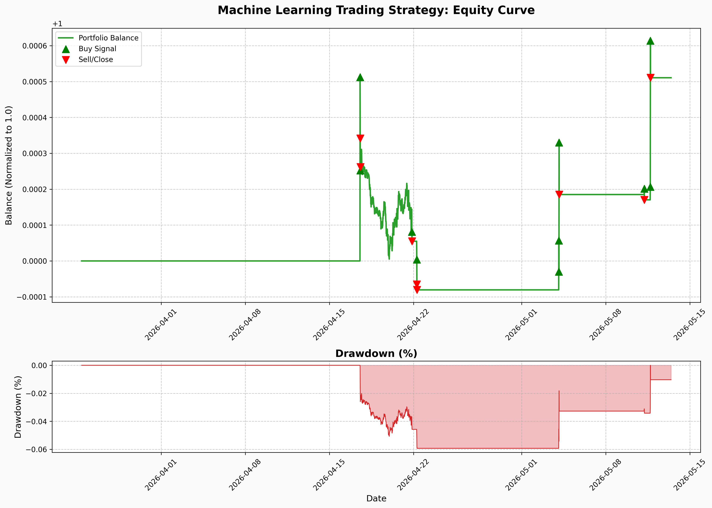

# TINYLLM

TinyLLM is a compact, hands-on repository built to understand and train small-scale language models from the ground up. Instead of relying on high-level frameworks, it focuses on explicit model architecture, tokenizer training, dataset preparation, and step-controlled training loops.

The project experiments with training decoder-only language models in the 2M–20M parameter range on carefully chosen datasets, using modern practices like step-based early stopping, cosine learning rate schedules, and mixed-precision training. Each script is designed to be reusable and configurable, making it easy to compare different model sizes and datasets while keeping the training process transparent and reproducible.

---

## Table of Contents

- [Features](#features)
- [Model Performance & Benchmarks](#model-performance--benchmarks)
- [Installation](#installation)
- [Usage](#usage)
- [Repository Structure](#repository-structure)
- [Configuration](#configuration)
- [Architecture](#architecture)
- [Screenshots](#screenshots)
- [Contributing](#contributing)
- [License](#license)

---

## Features

- **Tokenizer Training:** Train a SentencePiece tokenizer directly on the target dataset to ensure the vocabulary matches the data the model is trained on.
- **Dataset Processing:** Load, filter, and chunk raw text datasets into fixed-length sequences suitable for autoregressive language modeling.
- **Configurable Architecture:** Define model size, depth, and training behavior through configuration files, making it easy to experiment with different setups.
- **Lightweight Setup:** Keep the codebase minimal and explicit, focusing on clarity and control rather than heavy abstractions.

---

## 📊 Model Performance & Benchmarks

The model is evaluated and benchmarked on a standard text generation task. Below are the key metrics and performance benchmarks achieved by the **TinyLLM-2.75M** model during inference on an NVIDIA GPU (`cuda` device):

### 🔑 Key Metrics

> [!NOTE]
> **TinyLLM-2.75M Evaluation Summary**
> - **Validation Loss:** `2.0213`
> - **Perplexity (PPL):** `7.55`
> - **Generation Throughput:** `83.20` Tokens / Second
> - **Latency per Token:** `12.02` ms

### ⚙️ Benchmark Details

| Parameter / Metric | Value | Category / Details |
| :--- | :--- | :--- |
| **Total Parameters** | 2.75 M | Model Size |
| **Validation Loss** | 2.0213 | Loss |
| **Perplexity** | 7.55 | Model Perplexity |
| **Prompt Tokens** | 4 | Input size |
| **Generated Tokens** | 46 | Output size |
| **Generation Time** | 0.55 sec | Total wall time |
| **Tokens / Second** | 83.20 | Throughput |
| **Latency / Token** | 12.02 ms | Per-token generation speed |
| **Inference Device** | `cuda` | GPU acceleration |

### 📈 Backtest Report



---

## Installation

1. Clone the repository:

```bash
$ git clone https://github.com/Ghnkrk/TINYLLM.git
```

2. Install the required dependencies:

```bash
$ pip install -r requirements.txt
```

---

## Usage

### Tokenizer Training

To train the SentencePiece tokenizer, execute:

```bash
$ python tokenizer/train_tokenizer.py
```

### Model Training

Configure your desired settings in `config/config.json`, then initiate model training:

```bash
$ python train.py
```

### Parameter Check

To verify the model size and parameter distribution before training, run:

```bash
$ python param_count.py
```

### Inference & Text Generation

Run text generation using a trained model checkpoint:

```bash
$ python inference.py --ckpt best_model.pt --prompt "Once upon a time..."
```

> [!TIP]
> You can fine-tune generation using the following flags:
> - `--temperature`: Controls randomness (default: `0.8`).
> - `--top_k`: Filters top K tokens (default: `40`).
> - `--top_p`: Filters top P tokens (Nucleus sampling, default: `0.9`).
> - `--repetition_penalty`: Penalizes repetitive sequences (default: `1.1`).
> - `--max_new_tokens`: Maximum tokens to generate (default: `100`).

---

## Repository Structure

```
TINYLLM/
├── config/
│   ├── config.json           # Default active configuration
│   ├── config_2M.json        # Configuration for small (2M) model
│   └── config_20M.json       # Configuration for larger (20M) model
├── tokenizer/
│   ├── train_tokenizer.py    # Script to train SentencePiece tokenizer
│   ├── tinystories_sp.model  # Trained SentencePiece model file
│   └── tinystories_sp.vocab  # Trained SentencePiece vocabulary file
├── Architecture.py           # Core Transformer architecture (Decoder-only + RoPE + SwiGLU)
├── data.py                   # Dataset downloading and processing (e.g. TinyStories)
├── train.py                  # Model training loop with evaluation and early stopping
├── inference.py              # Interactive text generation script and benchmarks
├── param_count.py            # Utility script to check parameter counts
├── requirements.txt          # Python dependencies
├── pyproject.toml            # Project packaging metadata
└── .gitignore                # File to exclude virtual env and large checkpoints
```

---

## Configuration

The repository includes pre-defined configurations inside the `config/` directory:

- **`config_2M.json`**: Defines parameters for a smaller (~2.75M) model.
- **`config_20M.json`**: Defines parameters for a larger model.

To run with a specific configuration, copy it to `config/config.json` before training/inference:
```bash
$ copy config/config_2M.json config/config.json
```

---

## Architecture

This repository implements a decoder-only language model architecture. At its core, it includes:

- **Transformer Layers**: A stack of transformer blocks composed of self-attention and feedforward sublayers for contextual token processing.
- **Rotary Positional Encoding (RoPE)**: Applied within the attention mechanism to inject relative positional information without explicit position embeddings.
- **Self-Attention Mechanism**: Uses scaled dot-product self-attention to allow each token to attend to other tokens in the sequence.
- **Feedforward Networks**: Position-wise feedforward layers utilizing SwiGLU activation that transform token representations after attention.
- **Decoder-Only Architecture**: Uses masked self-attention for autoregressive language modeling, where each token attends only to past tokens.

---

## Screenshots

Add your screenshots below for better visualization. Replace these placeholders with your images:

- Autoregressive Architecture:


---

## Contributing

Contributions are welcome! Feel free to fork the repository, make enhancements, and submit a pull request.

### Steps to Contribute

1. Fork the repository.
2. Create a new feature branch: `git checkout -b my-feature`.
3. Commit your changes: `git commit -m 'Add some feature'`.
4. Push to the branch: `git push origin my-feature`.
5. Open a pull request.

---

## License

This repository is licensed under the MIT License. See the `LICENSE` file for details.

---
